# Contacts-Android-App
This is an Contacts Android Application where the contacts are stored in internal database using Room Library.
Created as a Advanced Android Development Assignment 2 with requirements:
Ask the user to enter the following information: 
* First name
* Last name
* Email
* Phone number 
* Address

The application will then store this information in an SQLite [or Room] database table called Contact.
The application should always check how many records are in the database and display this information to the user as well.

The user should be able to:
* search for a specific person
* update the information of a person
* delete a person from phonebook

 

### Adding:

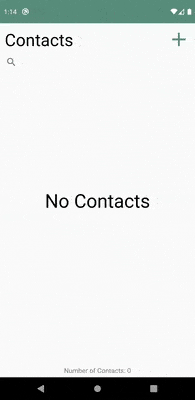
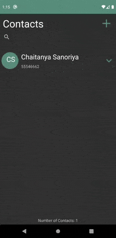

### Diplaying Contacts:

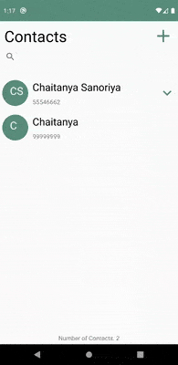
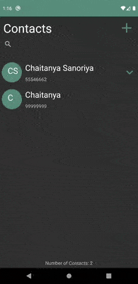

### Searching Contacts:

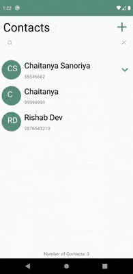
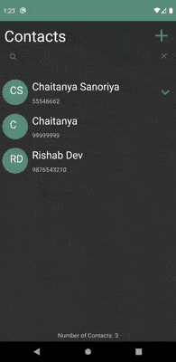

### Updating Contacts:

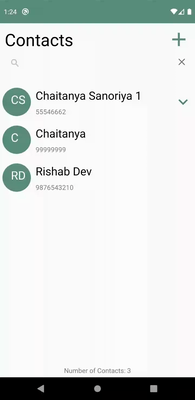
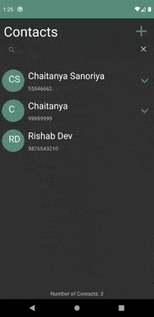

### Deleting Contacts:

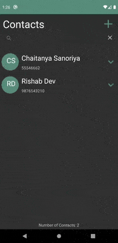
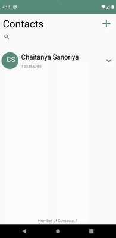
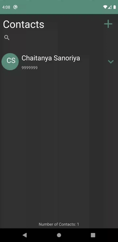

### Splash Screen:

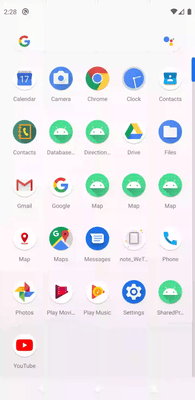
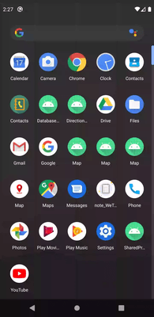
